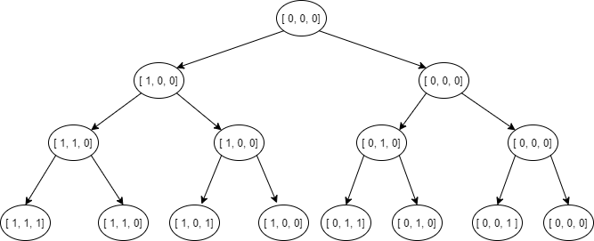

# Tarea 22

# Algoritmo del lechero

Usted es un original empresario de Azkoitia, y tiene la brillante idea de abrir una tienda de la leche en la
Plaza del pueblo. Como es una persona muy prudente, desea que la leche que venderá sea
perfectamente natural y fresca, y por esa razón, va a traer unas sanísimas vacas de desde Tolosa.
Dispone de un camión con un cierto límite de peso, y un grupo de vacas disponibles para la venta. Cada
vaca puede tener un peso distinto, y producir una cantidad diferente de leche al día.

Debes elegir qué vacas comprar y llevar en su camión, de modo que pueda maximizar la producción de
leche, observando el límite de peso del camión.

- Entradas:
  - Número total de vacas en la zona de Tolosa que están a la venta.
  - Peso total que el camión puede llevar.
  - Lista de pesos de las vacas.
  - Lista de la producción de leche por vaca, en litros por día.
- Salida
  - Cantidad máxima de producción de leche se puede obtener.
  - Vacas compradas.
  - Peso total de las vacas que se han comprado

## Solucion

Una vez recogidos los datos, el algoritmo ira comparando de manera recursiva que produccion de leche podemos conseguir si compramos una vaca o no, y se quedará con el máximo de ambos valores. Para calcular la producción total, debe de avanzar por todas las vacas y ahi es donde es clave la recursividad. Teniendo la vaca `I` pediremos la vaca `I + 1`, y con esa vaca tambien deberemos de calcular si nos conviene comprarla o no. Y asi hasta llenar nuestra capacidad.

```python
def calcularProducción(listaVacas, totalCapacidad, i, acumLeche, acumCapacidad):
  if(total < totalCapacidad):
   nuevaAcumLeche = acumLeche + listaVacas[i].leche
   nuevaAcumCapacidad = acumCapacidad + listaVacas[i].peso

   return max(
     calcularProducción(listaVacas, totalCapacidad, i+1, nuevaAcumLeche, nuevaAcumCapacidad),
     calcularProducción(listaVacas, totalCapacidad, i+1, acumLeche, acumCapacidad)
   )
  else:
    return total
}
```

Es decir, en un caso que tengamos 3 vacas, las reflejamos en un array de 3 posiciones. Cada nodo del arbol nos devolvera su valor y nos iremos quedando con el máximo.

- 0 --> vaca no comprada.
- 1 --> vaca comprada
  

## Ejecución

Es recomendable instalar [Miniconda](https://docs.conda.io/en/latest/miniconda.html), ya que ello trae el gestor conda, una version de python y una serie de utilidades.

Despues de instalar, bastaría con abrir la terminal _Anaconda Prompt_ que viene con miniconda, navegar a la carpeta de la tarea y ejecutar `python app.py`. Se pueden introducir los datos de prueba del siguiente punto para una ejecución controlada.

```console
C:\>cd git\theegg_ai\tarea_22

C:\git\theegg_ai\tarea_22>python app.py
¿Cuantas vacas hay en Tolosa?
...
```

## Datos de prueba

```
Vaca / Peso en kilogramos / Producción de leche por día
1 360 40
2 250 35
3 400 43
4 180 28
5 50 12
6 90 13

Camión de 700 kg

Vacas escogidas:

Vaca / Peso en kilogramos / Producción de leche por día
1 360 40
4 180 28
5 50 12
6 90 13
4x, total de 680kg,  producción total de leche 93L
```
